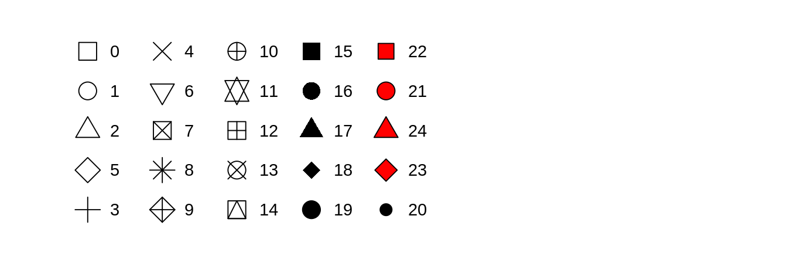

class:center, middle

##Fundamentals of Data Visualization
Claus Wilke  
https://clauswilke.com/dataviz/  


##R for Data Science
Hadley Wickham & Garrett Grolemund  
https://r4ds.had.co.nz/data-visualisation.html

## GGplot flipbook
Gina Reynolds
https://evamaerey.github.io/ggplot_flipbook/ggplot_flipbook_xaringan.html#1


---
name:index
## [Session 1](#Session1): Introduction | Aesthetics
## [Session 2](#Session2): Facets and statistics in ggplot
## [Session 3](#Session3): 
## [Session 4](#Session4): 
## [Session 5](#Session5): 

???
hyperlink the slides
---
class:middle, center
name: Session1
# Session1
## 28th Aug 2020
## Aesthetics
---
class:middle, center
###"All data visualizations map **data values** into **quantifiable features** of the resulting graphic. We refer to these features as **aesthetics**."
Fundamentals of Data Visualization *by Claus Wilke*
---
# Types of Aesthetics


**Remember aesthetics depend on the geometry**. There are more examples that we will cover later...

---

---
#Shapes in R

---
# Scales map data values onto aesthetics

---

---
class: middle, center

#data+aes+geometry

---

---
## GGplot flipbook
Gina Reynolds  

###On your own   
https://evamaerey.github.io/ggplot_flipbook/ggplot_flipbook_xaringan.html#1  
###In session  
https://evamaerey.github.io/ggplot2_grammar_guide/data_aes_geom.html#37

---
class:middle, center
name: Session2
# Session 2
## 18th Sep 2020
## Facets and Statistics
---

#data+aesthetics+geom
--
```{r eval=FALSE}
ggplot(data = <DATA>) + 
  <GEOM_FUNCTION>(mapping = aes(<MAPPINGS>))
```
--
- **facets**
- **statistics**
- coordinates
- theme
---
#Example
```{r eval=FALSE}
ggplot(data = mpg) + 
  geom_point(mapping = aes(x = displ, y = hwy))
```


---
#Example
```{r eval=FALSE}
ggplot(data = mpg) + 
  geom_point(mapping = aes(x = displ, y = hwy, color = class))
```

---
# Facets
- Useful for categorical variables
- Split your plot into facets or subplots 
- `facet_wrap()`

```{r eval=FALSE}
ggplot(data = mpg) + 
  geom_point(mapping = aes(x = displ, y = hwy)) + 
  facet_wrap(~ class, nrow = 2)
```
---
```{r eval=FALSE}
ggplot(data = mpg) + 
  geom_point(mapping = aes(x = displ, y = hwy)) + 
  facet_wrap(~ class, nrow = 2)
```

---
# Statistical transformations
- When ggplot computes a value to show on the plot
```{r eval=FALSE}
ggplot(data = diamonds) + 
  geom_bar(mapping = aes(x = cut))
```
---
```{r eval=FALSE}
ggplot(data = diamonds) + 
  geom_bar(mapping = aes(x = cut))
```


---
# Statistical Transformation

--

- The algorithm used to calculate new values for a graph is called a **stat**, short for statistical transformation
- You can learn which stat a geom uses by inspecting the default value for the `stat` argument in `?geom_bar`
---
```{r eval=FALSE}
ggplot(data = diamonds) + 
  geom_bar(mapping = aes(x = cut, y = stat(prop), group = 1))
```
--


--
To find the variables computed by the stat, look for the help section titled **computed variables**.

---
class:middle, center
# End of Session 2
---

# What can we use color for?
### $\checkmark$ To distinguish $\color{purple}{\text{groups of data}}$ $\color{orange}{\text{from each other}}$
### $\checkmark$ To represent data values
### $\checkmark$ To <mark>highlight<mark>

---
# Distinguish groups

---
# To represent values

---
# To higlight

---